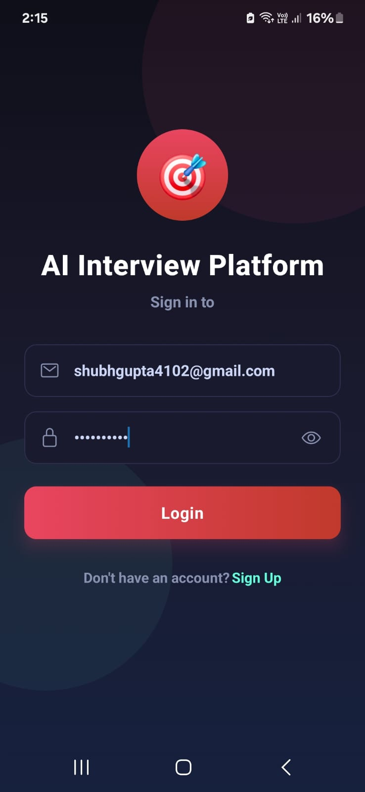
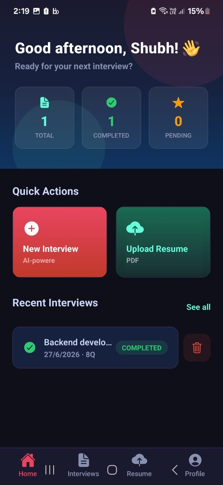
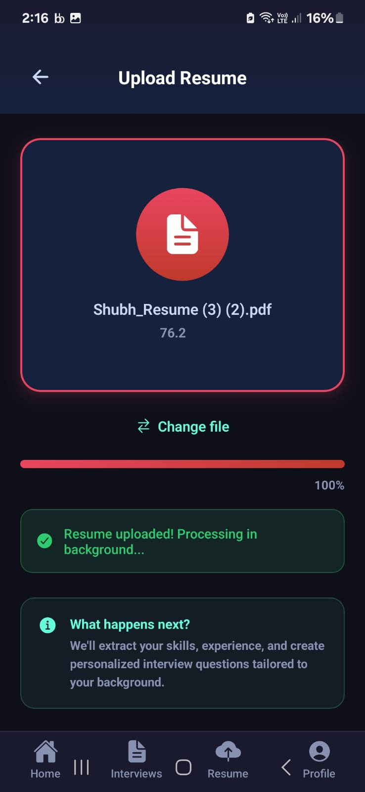
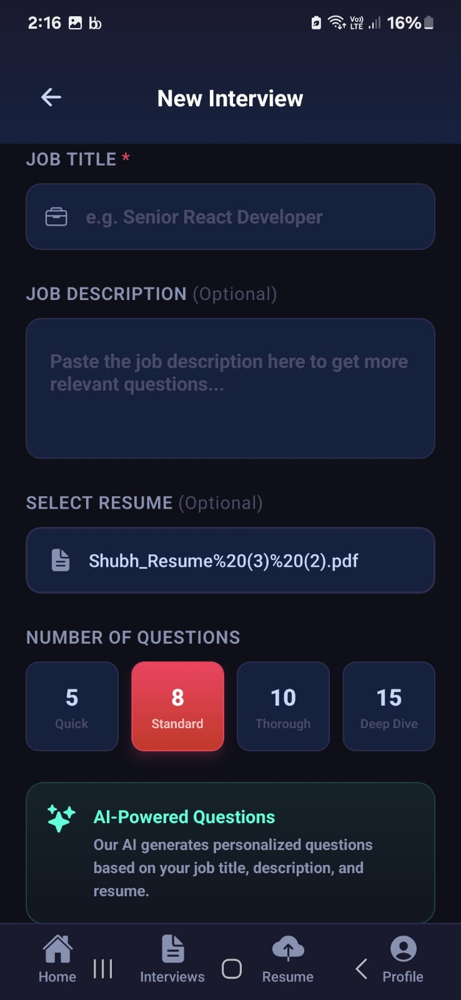
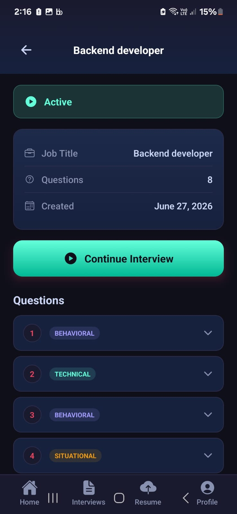
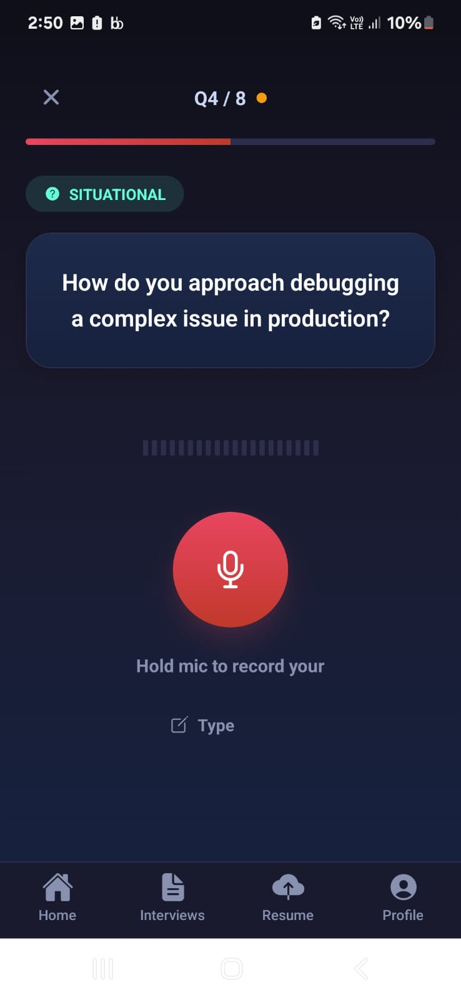
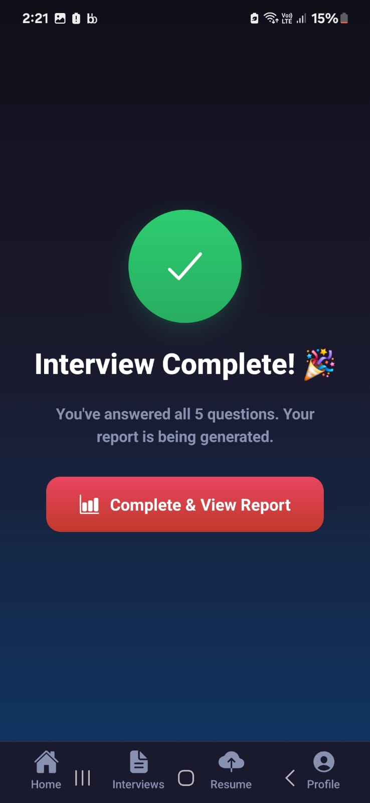
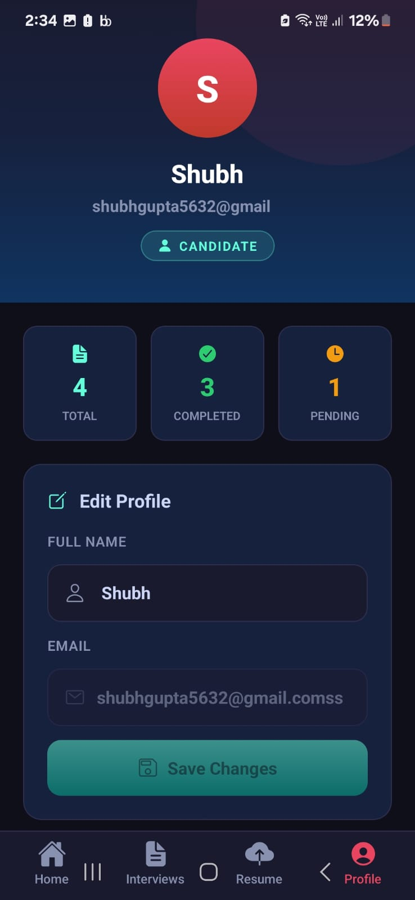

# AI Interview Platform

A production-grade AI Interview SaaS Platform with voice processing, cheating detection, LangGraph AI agents, and BullMQ background jobs.

## Architecture

```
Client ──► FastAPI Backend ──► PostgreSQL
                ├──► Redis Queue ──► BullMQ Worker
                ├──► Google Gemini (AI)
                ├──► OpenAI Embeddings + FAISS
                └──► Google Speech-to-Text (Voice)
```

## Screenshots

<div align="center">
  
  &nbsp;&nbsp;&nbsp;
  
  &nbsp;&nbsp;&nbsp;
  
  &nbsp;&nbsp;&nbsp;
  
  
  <br/><br/>
  
  
  &nbsp;&nbsp;&nbsp;
  
  &nbsp;&nbsp;&nbsp;
  
  &nbsp;&nbsp;&nbsp;
  
</div>

## Quick Start

### 1. Clone and Configure

```bash
cp .env.example .env
# Fill in your API keys in .env
```

### 2. Start All Services

```bash
docker compose up -d
```

### 3. Run Database Migrations

```bash
docker compose --profile migrate up migrate
# OR for local dev:
cd backend && alembic upgrade head
```

### 4. Access the API

- **API Docs:** http://localhost:8000/docs
- **ReDoc:** http://localhost:8000/redoc
- **Health:** http://localhost:8000/health

---

## Tech Stack

| Layer | Technology |
|---|---|
| Backend | FastAPI, Python 3.12 |
| Database | PostgreSQL + SQLAlchemy Async |
| Migrations | Alembic |
| Auth | JWT (access + refresh) + bcrypt |
| RBAC | CANDIDATE / RECRUITER roles |
| AI | LangGraph + Google Gemini 1.5 Pro |
| Embeddings | OpenAI text-embedding-3-small |
| Vector DB | FAISS (local) |
| Voice | Google Cloud Speech-to-Text |
| Queue | Redis + BullMQ (Node.js) |
| Email | SMTP (Nodemailer) |
| Reports | ReportLab PDF |
| Deployment | Docker + Docker Compose |

---

## Roles & Permissions

| Role | Permissions |
|---|---|
| CANDIDATE | upload:resume, attend:interview, view:own_report, submit:cheating_event |
| RECRUITER | create:interview, view:all_reports, view:cheating_report, list:candidates |

---

## API Endpoints

### Auth
```
POST /api/auth/signup     Register (role: CANDIDATE or RECRUITER)
POST /api/auth/login      Login → access + refresh tokens
POST /api/auth/refresh    Refresh access token
POST /api/auth/logout     Logout
GET  /api/auth/me         Get own profile
```

### Resumes
```
POST /api/resumes/upload         Upload PDF resume (CANDIDATE)
GET  /api/resumes/me             List own resumes (CANDIDATE)
GET  /api/resumes/{id}           Get resume by ID
```

### Interviews
```
POST /api/interviews/                    Create interview (CANDIDATE)
GET  /api/interviews/history             Interview history
GET  /api/interviews/{id}                Get interview
POST /api/interviews/{id}/start          Start interview + generate questions
POST /api/interviews/{id}/complete       Mark complete + generate report
GET  /api/interviews/{id}/questions      List questions
WS   /api/interviews/ws/{id}/session     Real-time interview session
```

### Voice (WebSocket)
```
WS /api/voice/ws/{interview_id}/stream  Audio streaming + transcription
```

### Cheating Detection
```
POST /api/cheating/{id}/event    Report cheating event (CANDIDATE)
GET  /api/cheating/{id}/report   Cheating analysis (RECRUITER)
GET  /api/cheating/{id}/events   List all events (RECRUITER)
```

### Reports
```
GET /api/reports/{id}/download   Download PDF report
GET /api/reports/{id}/summary    JSON summary
```

### Users
```
GET   /api/users/me    Get profile
PATCH /api/users/me    Update profile
GET   /api/users       List candidates (RECRUITER)
```

---

## Cheating Detection Categories

| Category | Severity | Description |
|---|---|---|
| TAB_SWITCH | MEDIUM | User switched browser tab |
| WINDOW_BLUR | LOW | Browser window lost focus |
| COPY_PASTE | MEDIUM | Copy or paste detected |
| MULTIPLE_FACES | HIGH | Multiple faces in camera |
| NO_FACE | MEDIUM | No face detected |
| LOOKING_AWAY | LOW | Eye gaze off screen |
| EXTERNAL_VOICE | MEDIUM | Background voices in audio |
| SCREEN_SHARE | HIGH | Screen recording detected |
| DEVTOOLS_OPEN | HIGH | Browser DevTools opened |
| KEYBOARD_MISMATCH | HIGH | Typing inconsistent with voice |

---

## BullMQ Job Queues

| Queue | Job | Triggered By |
|---|---|---|
| resume-processing | PROCESS_RESUME | Resume upload |
| generate-report | GENERATE_REPORT | Interview completion |
| send-email | SEND_EMAIL | Resume processed / Interview done |

---

## AI Pipeline (LangGraph)

```
Resume Text + Job Title
       ↓
  Resume Agent        → Extract skills, experience, education
       ↓
 Interview Agent      → Generate 10 tailored questions (Gemini)
       ↓
  [Live Interview]    → Candidate answers via voice/text
       ↓
 Evaluator Agent      → Score each answer (0-10) + feedback
       ↓
   Report Agent       → PDF report with cheating analysis + recommendation
```

---

## Local Development

```bash
# Backend only
cd backend
pip install -r requirements.txt
uvicorn app.main:app --reload

# Worker only
cd worker
npm install
npm run dev

# Database migration
cd backend
alembic upgrade head
```

---

## Environment Variables (key ones)

```env
GEMINI_API_KEY=          # Google Gemini API key
OPENAI_API_KEY=          # OpenAI API key (embeddings only)
GOOGLE_APPLICATION_CREDENTIALS=  # Path to GCP service account JSON
SMTP_HOST=smtp.gmail.com
SMTP_USER=your@gmail.com
SMTP_PASSWORD=           # Gmail App Password
JWT_SECRET_KEY=          # Long random string
INTERNAL_API_KEY=        # Secret for worker↔API communication
```
